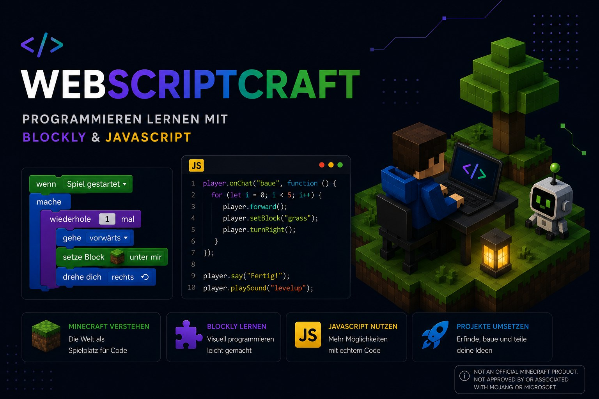

# JSMN IDE — JavaScript Minecraft Blocks

> A visual block-based programming IDE for building structures in Minecraft using JavaScript.
> Drag blocks → generate JS → run in Minecraft with `/rs functionName`.




---

## What is this?

**JSMN IDE** is a browser-based coding tool for the [JSMN Spigot plugin](https://github.com/cndrbrbr/jsmn) — a Minecraft server plugin that lets players write and run JavaScript to build structures.

Built in the tradition of [ScriptCraft by Walter Higgins](https://github.com/walterhiggins/ScriptCraft), this IDE makes it accessible to beginners and children through [Google Blockly](https://developers.google.com/blockly) — a drag-and-drop block editor — with an **instant 3D preview** powered by Three.js running entirely in the browser.

```
┌──────────────────────────────┐     ┌─────────────────────┐
│   Blockly Editor             │────▶│  draw.js            │
│  (drag & drop blocks)        │     │  function draw() {  │
│                              │     │    drone.box(        │
│  [function draw]             │     │      "DIRT",2,2,2); │
│    [box DIRT 2×2×2]          │     │    drone.up(2);     │
│    [up 2]                    │     │    drone.box(        │
│    [box DIAMOND 1×1×1]       │     │      "DIAMOND_BLOCK"│
│  [end function]              │     │      ,1,1,1);       │
│  [preview function draw]     │     │  };                 │
│                              │     │  draw();            │
│                              │     │  player.send...     │
└──────────────────────────────┘     └──────────┬──────────┘
                                                │
                 ┌──────────────────────────────┘
                 ▼
    ┌────────────────────────┐        ┌─────────────────────┐
    │  Three.js 3D Preview   │        │  Minecraft Server   │
    │  (runs in browser,     │        │  /rs draw           │
    │   no server needed)    │        │  → builds in-game!  │
    └────────────────────────┘        └─────────────────────┘
```

---

## Features

- **Blockly v12** — latest Google Blockly, loaded from CDN
- **30+ Minecraft materials** — full Bukkit Material enum names (DIRT, QUARTZ_BLOCK, RED_WOOL, …)
- **Live 3D preview** — Three.js renderer runs the drone simulation entirely in the browser; no PHP or Node.js required
- **Interactive camera** — drag to orbit, scroll to zoom
- **Local save/load** — workspace saved as JSON, multiple files can be loaded and combined
- **JSMN-compatible output** — generates `drone.box("DIRT", 2, 2, 2)` ready to drop into `/plugins/jsmn/scripts/`
- **Legacy XML support** — load old `.xml` files from the original webscriptcraft

---

## Quick Start

### Option A — HTTPS server (recommended for classroom use)

Uses a self-signed certificate so browsers don't upgrade HTTP to HTTPS silently.

```bash
git clone https://github.com/cndrbrbr/webscriptcraft.git
cd webscriptcraft

# 1. Generate a self-signed SSL certificate (once)
bash setup-ssl.sh

# 2. Start the HTTPS server
python3 serve-https.py

# 3. Open in browser (accept the self-signed cert warning)
#    https://localhost:4443   or   https://<your-server-ip>:4443
```

> Browser will show a certificate warning — click **Advanced → Proceed** to continue.
> The cert is valid for 10 years. Regenerate it any time with `bash setup-ssl.sh`.

### Option B — Plain HTTP (local development only)

```bash
cd webscriptcraft/openb3
python3 -m http.server 8080
# open http://localhost:8080
```

> Works locally but browsers may block access from other machines via plain HTTP.

### Option C — nginx with HTTPS (if nginx is installed)

```bash
# Generate cert first
bash setup-ssl.sh

# Install nginx config (adjust paths inside the file first)
sudo cp nginx/jsmn-ide.conf /etc/nginx/sites-available/jsmn-ide
sudo ln -s /etc/nginx/sites-available/jsmn-ide /etc/nginx/sites-enabled/
sudo nginx -t && sudo systemctl reload nginx
```

### Option D — PHP server (full features: server-side save/load)

Requires PHP 7+ and a web server (Apache/Nginx).

```
/var/www/openb3/   ← point your web root here
```

---

## How to Use

### 1. Build with blocks

Open the IDE. The left panel is your Blockly workspace, pre-loaded with a demo program.

| Category | Blocks available |
|----------|-----------------|
| **JSMN Drone** | `function`, `end function`, `preview function`, `call`, `box`, `box0`, `move`, `move by var` |
| **Loops** | `repeat`, `while`, `for`, `for each` |
| **Logic** | `if/else`, `compare`, `and/or`, `not` |
| **Math** | `number`, `arithmetic`, `random`, … |
| **Variables** | Blockly variables |
| **Functions** | Blockly procedure blocks |

### 2. Preview in 3D

Click **▶ 3D Vorschau** — the drone simulation runs in your browser and renders a Three.js scene on the right.

- **Left-drag** — orbit the camera
- **Right-drag** — pan
- **Scroll** — zoom in/out

### 3. Download the JavaScript

Click **JavaScript ↓** — downloads a `.js` file named after your function (e.g. `draw.js`).
Copy it to your Minecraft server's scripts folder:

```
/plugins/jsmn/scripts/draw.js
```

The file already contains the function call and a completion message at the bottom:

```javascript
draw();
player.sendMessage("Done!");
```

JSMN executes it automatically when the script loads and notifies you in chat when the build is complete. You can also re-run it any time with:

```
/rs draw
```

### 4. Save & Load your work

| Button | Action |
|--------|--------|
| 💾 **XML speichern** | Downloads workspace as `functionName.json` |
| 📂 **XML laden** | Load a `.json` or `.xml` file — replaces current workspace |
| ➕ **XML hinzuladen** | Load one or more files — **adds** to current scene |

> **Tip:** Use **hinzuladen** to combine multiple saved models — load a house, then add a garden, then preview them all together in 3D.

---

## Block Reference

### `box` — build a solid box

```
box  [material]  [width]  [height]  [depth]
```

Generates: `drone.box("DIRT", 2, 3, 2);`

### `box0` — build a hollow box (walls only)

```
box0  [material]  W [width]  H [height]  D [depth]
```

Generates: `drone.box0("GLASS", 5, 4, 5);`

### `move` — move the drone

```
[direction]  [amount]
```

Directions: `up`, `down`, `fwd`, `back`, `left`, `right`, `turn`

Generates: `drone.up(3);`

### `function` / `end function`

Wraps code in a named JavaScript function.

```
function  [name]
  ...blocks...
end function
```

### `preview function`

Marks the entry point of your program. Does two things:
- Tells the **3D preview** which function to call
- Adds `functionName();` at the end of the downloaded JS so JSMN runs it automatically

The downloaded file is also **named after this function** (e.g. `draw.js`).

### `call`

Calls another function by name — useful for building with helper functions.

---

## Materials (Bukkit Material Names)

| Display Name | JSMN Name | Display Name | JSMN Name |
|---|---|---|---|
| Dirt | `DIRT` | Quartz | `QUARTZ_BLOCK` |
| Grass | `GRASS_BLOCK` | Sandstone | `SANDSTONE` |
| Stone | `STONE` | Diorite | `DIORITE` |
| Cobblestone | `COBBLESTONE` | Andesite | `ANDESITE` |
| Glass | `GLASS` | Granite | `GRANITE` |
| Ice | `ICE` | Snow | `SNOW_BLOCK` |
| Glowstone | `GLOWSTONE` | Gravel | `GRAVEL` |
| Beacon | `BEACON` | Obsidian | `OBSIDIAN` |
| Diamond | `DIAMOND_BLOCK` | Emerald | `EMERALD_BLOCK` |
| Iron | `IRON_BLOCK` | Gold | `GOLD_BLOCK` |
| Air | `AIR` | Bedrock | `BEDROCK` |
| White Wool | `WHITE_WOOL` | Red Wool | `RED_WOOL` |
| Orange Wool | `ORANGE_WOOL` | Yellow Wool | `YELLOW_WOOL` |
| Lime Wool | `LIME_WOOL` | Green Wool | `GREEN_WOOL` |
| Blue Wool | `BLUE_WOOL` | Purple Wool | `PURPLE_WOOL` |
| Magenta Wool | `MAGENTA_WOOL` | Pink Wool | `PINK_WOOL` |

---

## Architecture

```
webscriptcraft/
├── openb3/                        # Web frontend (PHP optional)
│   ├── index.php                  # Main IDE page
│   ├── test.html                  # Static version (no PHP needed)
│   ├── blockly/
│   │   ├── webscript20220210.js   # Custom Blockly block definitions
│   │   └── webscriptstubs20220210.js  # Code generators (→ JSMN JS)
│   ├── data/                      # Server-side saved XML projects
│   ├── save.php / load_file.php / loaddirxml.php  # PHP save/load API
│   └── call3d.php                 # PHP → Node.js 3D pipeline (legacy)
│
└── x3do/                          # Server-side 3D pipeline (Node.js, optional)
    └── x3dsw/
        ├── ex2.js                 # Transforms generated JS for Node execution
        ├── Drones.js              # Virtual drone simulator (Node.js)
        ├── Filex3.js              # X3DOM HTML generator
        └── blocks.js             # Material name → texture PNG map
```

### Two 3D preview modes

| Mode | How | Requires |
|------|-----|----------|
| **Client-side** (default) | Three.js in browser, DronePreview JS class | Nothing — works offline |
| **Server-side** (legacy) | PHP → Node.js → X3DOM HTML | PHP + Node.js on server |

---

## Development

### Updating block materials

Edit `JSMN_MATERIALS` array in `openb3/blockly/webscript20220210.js`:

```javascript
var JSMN_MATERIALS = [
  ["Display Name", "BUKKIT_MATERIAL_NAME"],
  ...
];
```

The material name must match a [Bukkit Material](https://hub.spigotmc.org/javadocs/spigot/org/bukkit/Material.html) enum value.

Also add it to `BLOCK_COLORS` in `index.php` (hex colour for 3D preview) and to `blocks.js` (texture PNG for server-side preview).

### Adding a new block type

1. Define the block in `webscript20220210.js` using `Blockly.Blocks['name'] = { init: function() { ... } }`
2. Add its code generator in `webscriptstubs20220210.js` using `Blockly.JavaScript.forBlock['name'] = function(block) { ... }`
3. Add it to the toolbox in `index.php`

---

## Dependencies

| Library | Version | Purpose |
|---------|---------|---------|
| [Blockly](https://developers.google.com/blockly) | 12.4.1 | Visual block editor |
| [Three.js](https://threejs.org) | r140 | Client-side 3D preview |
| Three.js OrbitControls | r140 | Camera mouse controls |

All loaded from CDN — no `npm install` needed.

---

## Related

- [JSMN Plugin](https://github.com/cndrbrbr/jsmn) — the Spigot/Minecraft server plugin
- [ScriptCraft](https://github.com/walterhiggins/ScriptCraft) — the original inspiration
- [Blockly](https://developers.google.com/blockly) — Google's visual programming library

---

## License

Apache License 2.0 — see [LICENSE](LICENSE)

(c) 2022 cndrbrbr
